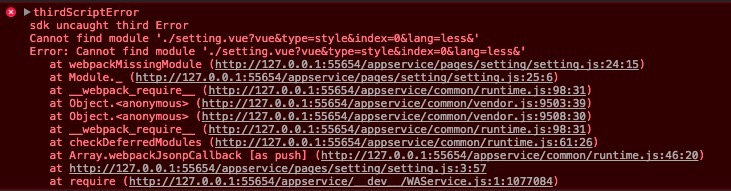

# project-config

# section 1

### Project setup
```
npm install
```

### Compiles and hot-reloads for development
```
npm run serve
```

### Compiles and minifies for production
```
npm run build
```

### Run your tests
```
npm run test
```

### Lints and fixes files
```
npm run lint
```

### Customize configuration
See [Configuration Reference](https://cli.vuejs.org/config/).

# section 2

### Environmental Installation
```
npm install -g @vue/cli
```

creat uni-app
```
vue create -p dcloudio/uni-preset-vue my-project
```
Preset options
select uni-app template, for example "Hello uni-app"

# section 3

### use less css style, lang='less'


### install less
```
npm install less less-loader --save-dev
```
config loader rules in babel.config.js
```
module.exports = {
    module: {
        rules: [
          {
            test: /\.styl$/,
            loader: "style-loader!css-loader!stylus-loader",
          }
        ]
    }
}
```
now, we can use less
```
<style lang='less'><style/>
```
